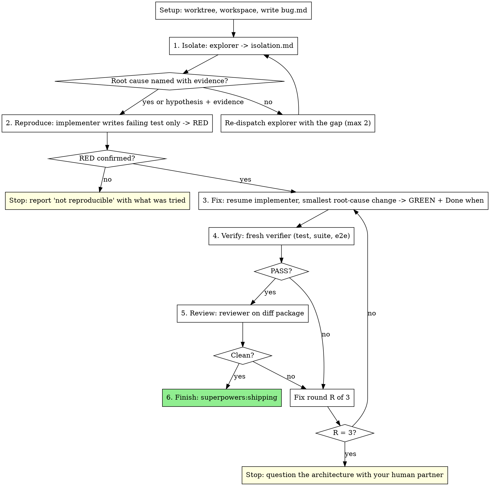

# Fixing Bugs

Orchestrate a bug fix with isolated roles. The reasoning discipline is
superpowers:systematic-debugging; this skill is the dispatch loop
around it.

**Core principle:** No fix without a failing reproduction. No completion
claim without a fresh verifier. The agent that fixes never verifies.

**Roles** (`.claude/agents/`, `.codex/agents/`): `explorer` isolates,
`implementer` reproduces then fixes, `verifier` re-runs everything,
`reviewer` reviews. Read the systematic-debugging skill yourself first;
its phases map onto the steps below.

## When to Use

- A reported bug, failing test, build failure, or regression
- You can run the project's tests
- Subagents are available (otherwise use systematic-debugging inline)

Not for: feature work (subagent-driven-development), flaky-test
archaeology with no reproduction after Step 2 (report, do not guess).

## The Process

## Setup

Work in a worktree (superpowers:using-git-worktrees). Never fix on
main without explicit consent.

Workspace: `<repo-root>/.superpowers/fix/<slug>/` (git-ignored). Files:
`bug.md`, `isolation.md`, `brief.md`, `report.md`, `verification.md`,
`progress.md`. If `progress.md` exists for this slug, resume at its last
step; do not redo completed steps.

Write `bug.md` from what your human partner gave you: symptom, exact
error text, where it was seen, what changed recently if known. Verbatim
where possible. Do not add a hypothesis yet.

Record BASE: `git rev-parse HEAD`.

## 1. Isolate

Dispatch `explorer` ([explorer-prompt.md](explorer-prompt.md)) with
`bug.md` and the `isolation.md` path. It runs systematic-debugging
Phase 1 and 2 read-only: reads the error, traces the data flow, checks
recent changes, finds the working pattern, names the root cause or a
single hypothesis with evidence.

Accept `isolation.md` when it has: exact reproduction steps or a
command, the affected files with line refs, and one root cause or one
hypothesis backed by evidence. Missing any: re-dispatch with the gap
named, at most twice. Still missing: stop and show your human partner
what was found.

Never isolate in your own context. Your context stays clean for
coordination.

## 2. Reproduce

Write `brief.md` ([brief-template.md](brief-template.md)) from
`isolation.md`: the reproduction, the suspected files, the test file
to create, and a **Done when** block. Dispatch `implementer` with the
brief and report path, with this instruction verbatim: "Write the
failing test only. Do not fix anything. Report RED output."

RED means the test fails on the reported symptom, not on a typo, an
import error, or a missing fixture. Read the RED output yourself. If it
is not RED, resume the implementer with the reason, once. Still not
RED: stop and report "not reproducible" with what was tried. A fix
without a reproduction is a guess.

Commit the test: `test: reproduce <bug>`.

## 3. Fix

Resume the same implementer: "The test is RED. Now fix the root cause
named in the brief with the smallest change. No bundled refactors, no
'while I'm here'. GREEN, then run every Done-when command." It commits,
appends to `report.md`, replies with the short contract.

If it reports BLOCKED because the root cause was wrong, that is new
information: go back to Step 1 with the report attached, not to another
fix attempt.

## 4. Verify

Dispatch `verifier` (`../subagent-driven-development/verifier-prompt.md`)
with the brief, report, BASE, and `verification.md`. It re-runs the
reproduction (must pass), the Done-when block, the full suite, and the
e2e stage when a compose file or `scripts/e2e.sh` exists.

FAIL → fix round. A fix round is one resume of the implementer with the
verifier's failing lines, then a fresh verification appended to
`verification.md`. **Three rounds maximum.** Round 3 still failing is
systematic-debugging's 3-fixes rule: stop, and question the
architecture with your human partner. Do not dispatch round 4.

## 5. Review

`scripts/review-package` from subagent-driven-development, BASE..HEAD.
Dispatch `reviewer` with the task-reviewer template, using `brief.md`
as the brief and `isolation.md` as the spec. Critical/Important
findings enter the same three-round cap. Minors go to `progress.md`.

## 6. Finish

Append `complete (commits <base7>..<head7>)` to `progress.md`. Use
superpowers:shipping. Deploying anywhere beyond the local compose
stack is a human decision; the verifier's e2e is the last automated
stage.

## Stops

Stop and ask only for: not reproducible after Step 2; round cap hit;
the fix needs a change outside the worktree (schema migration, shared
infra, a protected branch); the fix is destructive or
security-sensitive. Everything else is a ruling: decide, write it in
`progress.md` as `Ruling: <what> — <why>`, and continue.

## Common Rationalizations

| Excuse | Reality |
|--------|---------|
| "I can see the bug, skip isolation" | Seeing a symptom is not a root cause. The explorer is cheap; a wrong fix is not. |
| "The test would be trivial, fix first" | A fix without RED cannot be verified. RED first, always. |
| "Implementer said GREEN, skip the verifier" | The implementer grades its own work. Fresh run or no claim. |
| "One more round will get it" | Round 4 is where thrash starts. Three failures means the model of the bug is wrong. |
| "E2E is slow, unit tests are enough" | The bug was reported from the running system. Verify there. |
| "I'll patch it in my own context" | Controller fixes skip review and pollute your context. Resume the implementer. |
