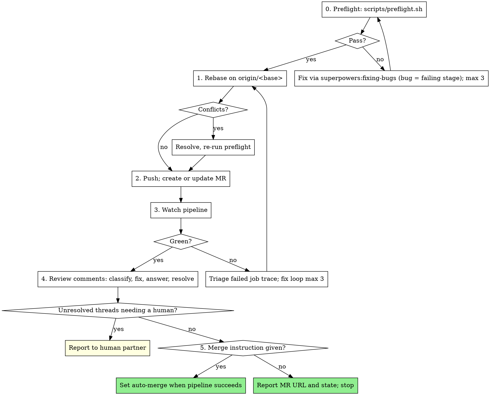

# Shipping

Get a verified branch through the remote pipeline and merge request
with as little agent judgment as possible. Scripts decide; you step in
only when a script fails.

**Core principle:** Preflight locally, push once, watch, fix in a loop
with a cap. Never force-push a shared branch. Never merge a protected
branch without your human partner saying so.

**Announce at start:** "Using shipping to get <branch> to <base>."

## Preconditions

- superpowers:verification-before-completion: the suite is green on this
  tree, in this message. No green, no shipping.
- You are on a feature branch. On `main`/`master`/`dev`: stop, ask.
- Forge and CLI: `git remote -v` → GitLab (`glab`) or GitHub (`gh`).
  Commands below are GitLab; GitHub equivalents in the table at the end.
- Base branch: from the plan, the MR, or `glab mr view`; else ask once.

## Process



## 0. Preflight

Run `scripts/preflight.sh` (or `.agents/scripts/preflight.sh` when
vendored). It lints the CI config, runs the local CI stages with
`gitlab-ci-local`, and runs the tests. Read the whole output.

A failing stage is a bug: use superpowers:fixing-bugs with the stage's
output as `bug.md`. Three preflight failures in a row: stop and show
your human partner the last output.

`gitlab-ci-local` sees only staged or committed files. Commit before
preflight; an unstaged edit is invisible to it.

## 1. Rebase

```bash
git fetch origin
git rebase origin/<base>
```

Conflicts: resolve one file at a time. For each, read both sides and
the commits that produced them (`git log -p origin/<base> -- <file>`),
keep the intent of both, and never resolve by taking one side wholesale
without reading the other. After `git rebase --continue`, re-run
preflight; a clean rebase can still break tests.

Too tangled (a file rewritten on both sides, semantics unclear): abort
(`git rebase --abort`) and ask, with the file list.

## 2. Push and MR

```bash
git push -u origin <branch>                 # first push
git push --force-with-lease origin <branch> # after a rebase, own MR branch only
```

`--force-with-lease` is allowed only on the branch this MR owns and
only after a rebase you performed. Never `--force`. Never any force on
a branch someone else has commits on (`git log origin/<branch> --format=%an`
shows more than one author: stop, ask). The installed `pre-push` hook
enforces the protected-branch rule; do not bypass it with
`--no-verify`.

MR:

```bash
glab mr view >/dev/null 2>&1 || glab mr create --fill --target-branch <base> --remove-source-branch
```

Title and description from the branch's commits and the plan or spec.
Follow the repo's MR template if one exists. Report the URL.

## 3. Watch the pipeline

```bash
glab ci status --live          # bounded: stop watching after 20 min, check with `glab ci status`
```

Failed:

```bash
glab ci list --per-page 1                # pipeline id
glab ci get --pipeline-id <id>           # jobs and statuses
glab ci trace <job-id>                   # log of the failed job
```

Read the trace. Classify:
- **Code failure** (test, lint, build): fixing-bugs, `bug.md` = the
  trace tail plus the job name. Push, watch again.
- **Config failure** (job definition, image, variables): fix
  `.gitlab-ci.yml`, run `glab ci lint`, push, watch again.
- **Infra failure** (runner offline, registry timeout, quota): retry
  once with `glab ci retry`; still failing, report to your human
  partner. Do not "fix" infra by editing the job.

Three fix rounds maximum. The fourth failure is a report, not a push.

## 4. Review comments

Fetch unresolved threads:

```bash
glab api "projects/:id/merge_requests/<iid>/discussions" \
  | jq '[.[] | select(.notes[0].resolvable and (.notes[0].resolved|not))
        | {id, path: .notes[0].position.new_path, line: .notes[0].position.new_line,
           author: .notes[0].author.username, body: .notes[0].body}]'
```

Classify each thread, then act:

| Type | Action |
|------|--------|
| Requested code change, clear | Fix via fixing-bugs (small) or directly if a one-liner; commit `review: <what>`; reply with the commit SHA; resolve |
| Question about the code | Answer in a reply, with path:line. Do not resolve — the asker resolves |
| Style / nit | Apply if it matches the repo's conventions; otherwise reply why not, leave open |
| Disagreement, design question, or scope change | Do not act. Collect for your human partner |

Reply: `glab api -X POST "projects/:id/merge_requests/<iid>/discussions/<did>/notes" -f body="..."`.
Resolve: `glab api -X PUT "projects/:id/merge_requests/<iid>/discussions/<did>" -f resolved=true`.

Every reply names what changed and where. Never resolve a thread you
did not act on. After any code change: back to Step 1 (rebase, push,
watch).

## 5. Merge

Only when your human partner said to merge (in the request that
started this, or since). Otherwise report the MR URL, pipeline state,
and open threads, and stop.

```bash
glab mr merge --auto-merge --remove-source-branch --squash   # squash per repo convention
```

Auto-merge means the forge merges when the pipeline is green and
approvals are met. You do not wait for it. Report that auto-merge is
set and stop.

Protected base with required approvals you cannot grant: report, stop.

## GitHub equivalents

| GitLab | GitHub |
|--------|--------|
| `glab ci lint` | `actionlint` |
| `gitlab-ci-local` | `act` (optional; often skipped) |
| `glab mr create --fill` | `gh pr create --fill` |
| `glab ci status --live` | `gh pr checks --watch` |
| `glab ci trace <job>` | `gh run view <run> --log-failed` |
| discussions API | `gh api repos/:owner/:repo/pulls/<n>/comments` |
| `glab mr merge --auto-merge` | `gh pr merge --auto --squash` |

## Stops

Stop and ask for: on a protected branch; a shared branch needs a force;
rebase conflicts you cannot resolve with confidence; three failed fix
rounds at any step; infra failure after one retry; review threads
classified as disagreement or scope; merge not authorized.

## Common Rationalizations

| Excuse | Reality |
|--------|---------|
| "Preflight is slow, the pipeline will tell me" | The pipeline costs a runner and everyone's time. Preflight costs yours. |
| "Force push is fine, it's my branch" | Only after a rebase, only with `--force-with-lease`, only if no one else committed. Check authors. |
| "I'll resolve the thread, the fix is obvious" | Resolve only threads you acted on, with the SHA in the reply. |
| "They obviously want it merged" | Merge is a stated instruction, not an inference. |
| "The runner is flaky, edit the job to skip it" | Infra failures get one retry and a report. Job edits to dodge them hide real failures. |
| "One more pipeline run will pass" | Three rounds. Then report. |
